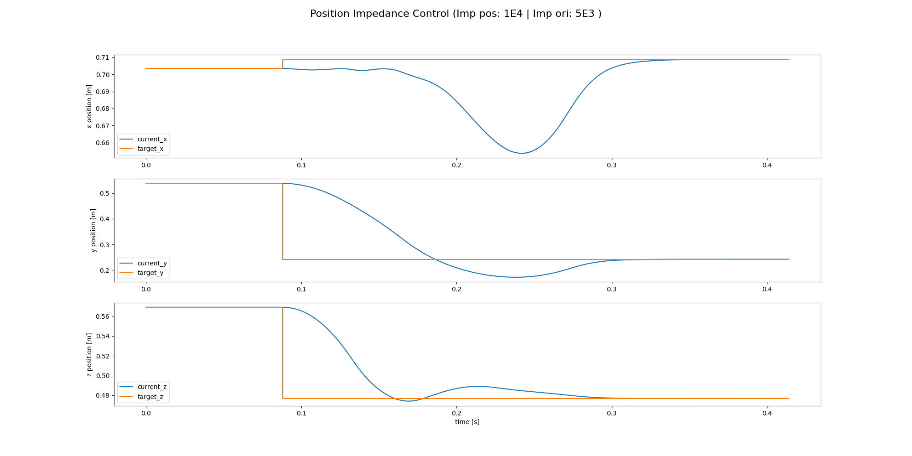

# OpSpace Controller Documentation

The `OpSpace` controller is an operational space controller used for controlling the end-effector position and orientation of a robot arm. This README explains the mathematics behind the controller's operation.

## Controller Overview

The controller aims to compute joint torques (`tau`) based on the desired end-effector pose (`T_target`) and the current robot state. These torques are then applied to the robot to achieve the desired end-effector motion. The controller uses Cartesian impedance control gains and joint impedance control gains to regulate the behavior of the robot's end-effector.

## Mathematical Formulation

### Cartesian Impedance Control

Cartesian impedance control regulates the interaction between the end-effector and the environment. The Cartesian impedance control gains $\mathbf {K}_p$ and $\mathbf {K}_d$ determine the stiffness and damping of the end-effector. The controller computes the spatial velocity (twist) $\dot{\mathbf{x}}$ as:

$$
\dot{\mathbf{x}} = K_{\text{pos}} \cdot \frac{\mathbf{t}^{base}_{\text{target}} - \mathbf{t}^{base}_{tcp}}{\text{sdt}}
$$

where $\mathbf{T}^{base}_{tcp}$ is the pose of the end-effector in the base frame, and $\mathbf{K}_{pos}$ is the position gain.

### Orientation Control

The controller also computes the twist for orientation control using quaternion algebra:

1. Compute the quaternion representation of the current end-effector orientation ($\mathbf{Q}_{tcp}$).
2. Compute the quaternion conjugate ($\mathbf{Q}_{tcp,conj}$).
3. Compute the quaternion error ($\tilde{\mathbf{Q}}$) by multiplying the desired orientation quaternion by the conjugate of the current orientation quaternion.
4. Convert the quaternion error to a 3D angular velocity.

### Joint Impedance Control

Joint impedance control regulates the behavior of individual joints. The controller computes the joint torques ($\boldsymbol{\tau}$ ) as:

$$
\boldsymbol{\tau} = \mathbf{J}^T \cdot \mathbf{M}_x \cdot (\mathbf{K}_p \cdot \dot{\mathbf{x}}- K_d \cdot (\mathbf{J} \cdot \dot{\mathbf{q}}))
$$

where $\mathbf{J}$ is the robot's Jacobian matrix, $\mathbf{M}_x$ is the inertia matrix, $\mathbf{K}_p$ and $\mathbf{K}_d$ are the Cartesian impedance control gains, and $\dot{\mathbf{x}}$ is the spatial velocity.

### Joint Nullspace Control

The controller also adds a joint task in the nullspace for overactuated manipulators to handle redundancy. This task aims to minimize joint position and velocity errors while satisfying Cartesian impedance control requirements.

### Gravity Compensation

Optionally, the controller applies gravity compensation to counteract the effect of gravity on the robot.
Acknowledgments
## Usage

To use the `OpSpace` controller, follow these steps:

1. Instantiate the controller with appropriate arguments and a reference to the robot.
2. Call the `step()` method of the controller at each control loop iteration to compute and apply the control torques.

## Step Response

### Acknowledgments
This work is based on the work of [Kevin Zakka](https://github.com/kevinzakka)'s implementation of [A Unified Approach for Motion and Force Control of Robot Manipulators: The Operational Space Formulation](https://khatib.stanford.edu/publications/pdfs/Khatib_1987_RA.pdf).
