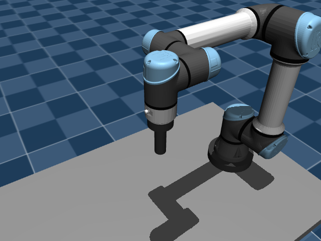
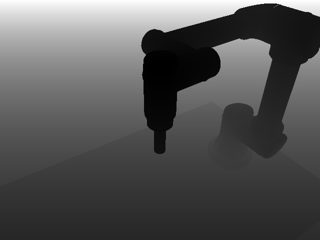
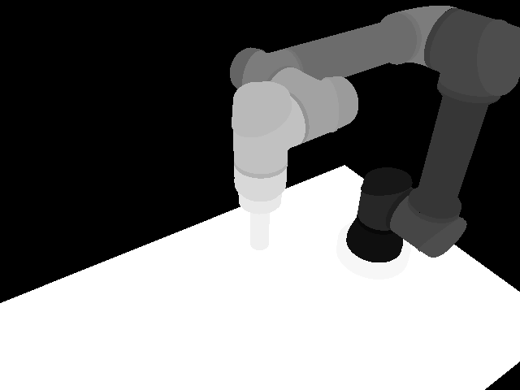
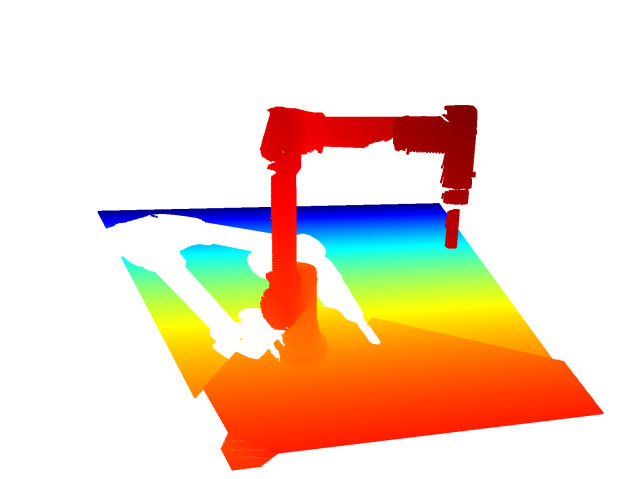

# Camera Class Documentation

The `Camera` class provides functionality for simulating a camera within a Mujoco environment, capturing RGB images, depth images, and point clouds. This README outlines the mathematical concepts involved in the class's operation.

## Class Overview

The `Camera` class initializes a camera instance with parameters such as width, height, Mujoco model, Mujoco data, camera name, and save directory. It computes intrinsic camera parameters, transformation matrices, and projection matrices. The class captures RGB images, depth images, and point clouds, and provides methods to save the captured data.

## Mathematical Formulation

### Intrinsic Camera Parameters

The intrinsic camera matrix (K) is computed based on the camera's field of view, width, and height, following the pinhole camera model. Focal length, pixel resolution, and optical center offsets are calculated to form the intrinsic matrix.

### Transformation Matrices

The homogeneous transformation matrix (T_world_cam) represents the camera's pose in the world frame. It is computed from the camera's position and orientation retrieved from Mujoco data.

### Projection Matrix

The projection matrix (P) is computed as the product of the intrinsic matrix (K) and the transformation matrix (T_world_cam). It maps 3D points from world coordinates to 2D image coordinates.
### Depth-to-Point Cloud Conversion

Depth images are converted to point clouds in camera coordinates. The process involves flattening arrays, negating depth values, computing inverse intrinsic matrix, and calculating 3D points in camera coordinates.

## Usage

To use the `Camera` class:

1. Instantiate the class with appropriate arguments and a Mujoco model and data.
2. Access properties like `image`, `depth_image`, and `point_cloud` to capture data.
3. Optionally, call the `save()` method to save captured images and depth information.

The `Camera` class facilitates capturing and processing images and depth information within a Mujoco environment.

Below is a table with samples of what the `Camera` class can produce

| RGB Image        | Depth Image (normalized)   | Segmentation Image (normalized)   | Point Cloud |
| -----------      | -------------------------- | --------------------------        | ----------- |
| |         |                  |        |


In order to add your own cameras, simply provide camera tags to the simulations MJCF (XML) file. The images above were generated from the camera in `scenes/scene.xml` which is defined in the following manner.

```xml
<camera
	name="cam"
	pos="1 1 1"
	mode="targetbody"
	target="flange_tool"
/>
```
for more information on how to define your own cameras and their behavior see the official [MuJoCo camera documentation]


[MuJoCo camera documentation]: https://mujoco.readthedocs.io/en/stable/XMLreference.html#body-camera
