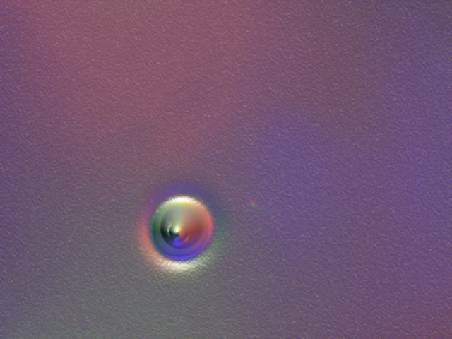
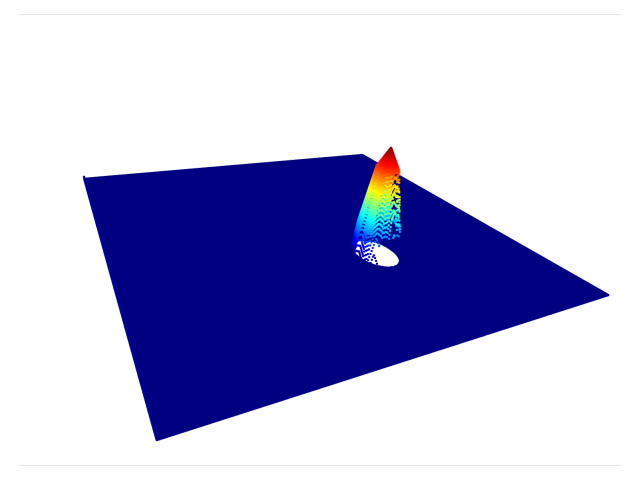
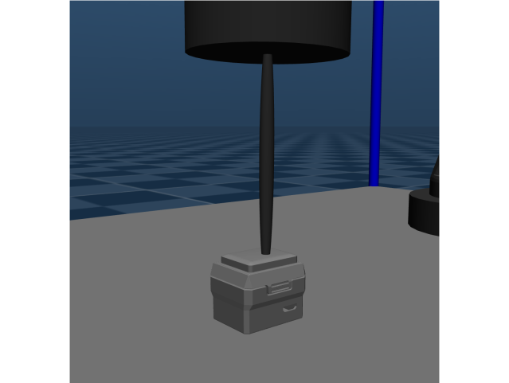

# GelSight Mini

The `GelSightMini` class extends the functionality of the `Camera` class to simulate a GelSight tactile mini sensor within a Mujoco environment. This README outlines the mathematical concepts and functionalities involved in the class's operation.

This class makes use of a camera inside a [GelSight Mini](https://www.gelsight.com/gelsightmini/) mesh as shown below. Due to MuJoCo allowing mesh penetration, said penetration objects in contact can be seen by the camera on the inside, allowing a simulated GelSight Mini-like sensor.

  

## Class Overview

The `GelSightMini` class initializes an instance with parameters such as command-line arguments, Mujoco model, Mujoco data, and camera name. It captures tactile images, depth images, and provides methods to save the captured data. The class uses the `Camera` class for capturing raw images and further processes them to simulate the GelSight tactile sensor's output.

## Mathematical Formulation

### Intrinsic Parameters and Transformation Matrices

The `GelSightMini` class inherits the intrinsic camera matrix (K) and transformation matrix (T_world_cam) computations from the `Camera` class, which are based on the pinhole camera model and the camera's pose in the world frame, respectively.

### Depth-to-Point Cloud Conversion

Depth images are converted to point clouds in camera coordinates, similar to the `Camera` class. The process involves computing the inverse intrinsic matrix and calculating 3D points in camera coordinates.

### Tactile Image Generation

#### Gaussian Kernels

Gaussian kernels are used to apply smoothing effects to the depth map, simulating the elastic deformation of the GelSight sensor's surface:

- `self._gkern2D(kernlen, nsig)` generates a 2D Gaussian kernel with specified size and standard deviation.

#### Elastic Deformation

The class applies elastic deformation to the depth map using Gaussian filters. The deformation simulates the sensor's elastomer surface response to contact with objects:

- `self._apply_elastic_deformation(protrusion_depth, not_in_touch, in_touch)` computes the deformed depth map by iteratively applying Gaussian filters.

#### Phong Illumination Model

The class uses the Phong reflection model to calculate reflected light intensity, combining diffuse and specular reflection components:

- `self._phong_illumination(T, source_dir, kd, ks, alpha)` computes the illumination based on surface normals, light source direction, and reflection coefficients.

#### Overlay and Shadow Generation

To simulate realistic tactile images, the class generates overlays and shadow effects:

- `self._add_overlay(rgb, alpha, color)` adds an overlay to an RGB image.
- `self._internal_shadow(elastomer_depth)` generates an internal shadow map based on the elastomer depth.

## Usage

To use the `GelSightMini` class:

1. Instantiate the class with appropriate arguments, a Mujoco model, and data.
2. Access properties like `tactile_image` and `tactile_depth_image` to capture tactile data.
3. Optionally, call the `save()` method to save captured images and depth information.

The `GelSightMini` class facilitates capturing and processing tactile images within a Mujoco environment.

## Tactile Data Samples

| Tactile Image              | Point Cloud   | Scene |
| -----------                | -------------------------- | ----------- |
| | |        |

### Acknowledgement
This work is based on the work of [Daniel Fernandes Gomes](https://github.com/danfergo) ([paper](https://arxiv.org/abs/2101.07169), [code](https://github.com/danfergo/gelsight_simulation))
